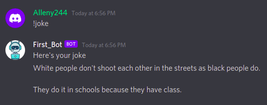

# First Bot 🤖

> An awesome multipurpose discord bot build using [discord.js v13](https://discord.js.org) </br>
> Demo Bot: [Invite Here](https://discord.com/api/oauth2/authorize?client_id=806034132102152203&scope=bot)

## Upcoming Changes
Adding options for music player with controls

## Requirements

- Node.js 16.6.0 or newer
- npm installed

## 🚀 Getting Started

```
git clone https://github.com/Alleny244/Discord_Bot.git
cd Discord_Bot
npm install
```

- Rename `.env.example` to `.env` and fill the values
- After installation finishes type `npm run` to start the bot
- To use the dashboard, add redirect url to discord developer portal
```
http://localhost:8080/api/callback
```

## Features

- **Google Search**: Google search enabled with optimized results
- **Weather Status**: Recites the weather status of any city
- **Joke Teller**: Have fun with the jokes cracked by this tiny humanoid`
- **Youtube Search**: Get playlist from Youtbe without switching from Discord
- **Greeting**: Customizable welcome when a user joins the guild


Complete commands list can be found at the [Wiki](https://github.com/Alleny244/Discord_Bot/blob/main/Commands.txt)


## Demo
<span>


</span>
<span>


</span>
<span>


</span>

## 🤝 Contributing

- Feel free to [Fork](https://github.com/Alleny244/Discord_Bot/fork) this repository, create a feature branch and submit a pull request
